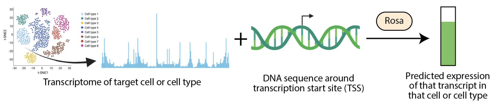
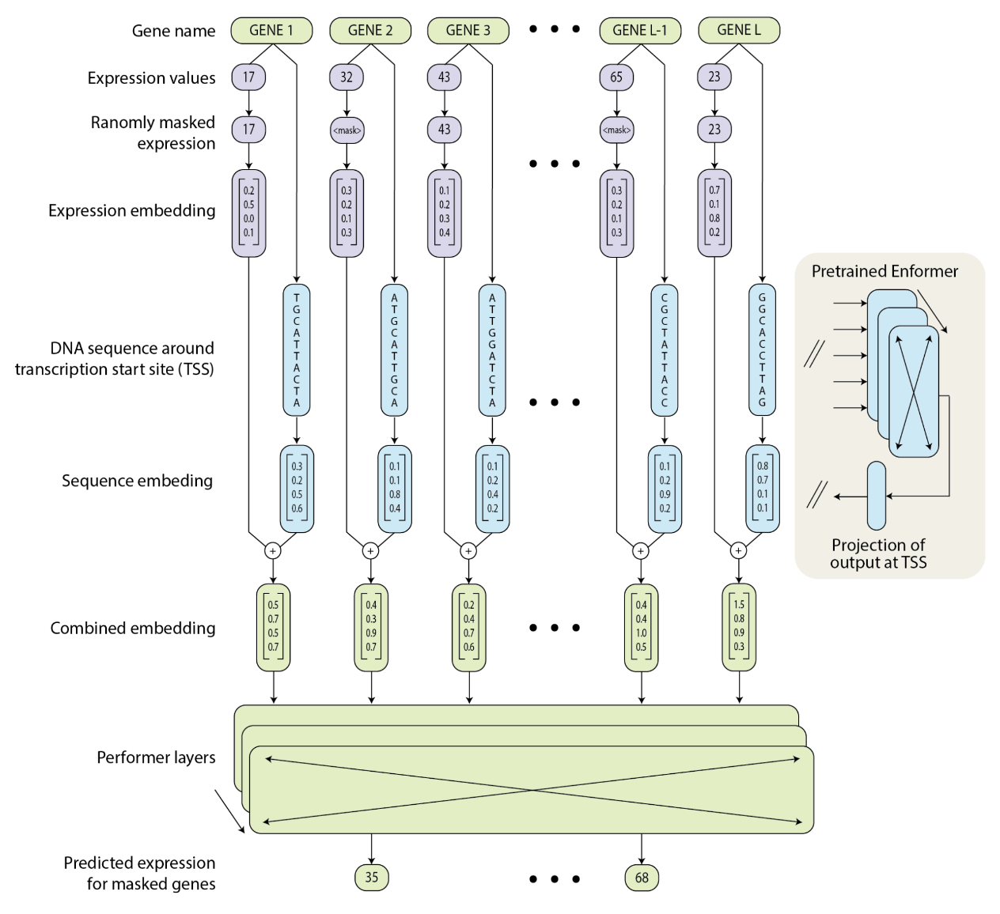

# rosa

Modeling single cell gene expression from the genome

*Status: exploratory project, unpublished. Worked on from Jan - May 2023, currently on pause. All code may undergo breaking changes, and any insights or results are subject to change as more work is done - this is open science! If you have any questions/ comments open an issue.*

## modeling single cell gene expression from the genome

Understanding how the genome influences expression in a cell-type specific manner is important for understanding disease causing variation and engineering cell-type specific regulatory elements. There has been substantial progress in our ability to predict gene expression in a cell-type specific manner by integrating long-range interactions using modern machine learning methods (e.g. [Enformer](https://www.nature.com/articles/s41592-021-01252-x)). Right now though models like Enformer are trained on a given set of cell-types, but have no possibility of generalizing to novel cell-types without being further trained (as cell-type is specificty an output of their model). Contemporaneously, there has been substantial interest in generating embeddings of single cell RNA sequencing data leveraging modern machine learning methods (e.g. [Geneformer](https://www.nature.com/articles/s41586-023-06139-9), [scGPT](https://www.biorxiv.org/content/10.1101/2023.04.30.538439v2), et al.). These models can generalize to novel cell-types, but have no ability to generalize across genomic variation as they encode gene-identity in a one-hot manner without reference to any underlying genomic information. There have been some efforts at moving beyond one-hot gene encodings to encodings leveraging the outputs of the coding sequence of the gene after it has been passed through a protein language model (e.g. [Saturn](https://www.biorxiv.org/content/10.1101/2023.02.03.526939v2)). This choice of embedding allows for a "universal cell embedding" that can incorporate data from different species in a single model. In this work we explore using a gene embedding derived from a genomic foundation model that includes the regulatory regions of the gene. We hypothesize that gene embeddings derived from the non-coding regulatory regions of the gene will show better generalization to novel genes compared to embeddings derived from protein coding regions.

## rosa approach

Here we are interested in predicting expression of genes in single cells using their dna sequences as inputs. 

We consider human single cell RNA sequencing data derived from the [Tabula Sapiens](https://tabula-sapiens-portal.ds.czbiohub.org/) project accessed through the [CZ CellXGene portal](https://cellxgene.cziscience.com/).

We split the data into train/ val/ test portions along both the cell axis and gene axis. Note this is very different from how most single cell rna seq foundation methods (like Geneformer and scGPT) split their data - those methods split their data only along the cell axis - and more similar to how genomic foundation models (like Enformer) split their data along the genomic axis (e.g. exclude a chromosome). So far we have only done random splits, but future work should do more controlled splits to avoid the many potential data leakage issues that can occur.

For each gene we then find the canonciacal transcription start site (TSS), extract the DNA sequence from +/- 100kB window from the reference genome and pass it through a [pre-trained implementation of enformer](https://github.com/lucidrains/enformer-pytorch). We then look at which potential TSS drives the strongest predicted human CAGE expression and take the embedding from that TSS to represent the gene of interest. Note that as enformer is trained on both human and mouse data we could use this approach to generate embeddings for any human or mouse gene, including any particpant specific variation. Here we just used human data, but there are strong reasons to suspect joint trainin on multiple species would give better generalization results.

For the single cell expression data we explored a variety of embedding methods, including count based, normalization, and rank ordering based approaches. Note that using the genome derived embeddings from enformer are compatible with all these choices.

We also explored a variety of transformer architectures including the performer and perciever approaches to improve training times for long context window.

### results (on pause)

Results for the model were very much in-progress when I paused this work. The main difficulty seemed to be generalization within gene space. It could be that multispecies training, or training with paired genome and single cell sequencing data might be important. I did not have access to any paired genome and single cell data, but that would be an interesting future approach. Looking within the training genes, but at validation cells suggests though that using the Enformer embeddings lead to better performance compared to either a one-hot or an ESM embedding. Clearly more future work is needed here to fully explore the potential of this idea.

## acknowledgements

Nicholas Sofroniew works at and is supported by the Chan Zuckberberg Initative. Thanks to Josh Batson for lots of very helpulf conversations and insights around the approach and Ziga Avsec for advice on what part of the enformer embedding to use. We thank lucidrains for re-implementing, retraining, and open-sourcing [enformer-pytorch](https://github.com/lucidrains/enformer-pytorch).
